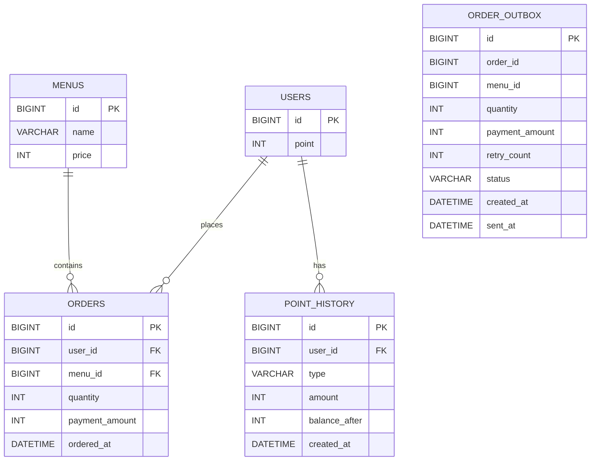

# Coffee Order System

커피숍 주문 시스템 백엔드 과제 프로젝트입니다.

## 목차

1. 프로젝트 소개
2. 개발 환경 및 기술 스택
3. 주요 기능
4. API 명세
5. ERD
6. 핵심 설계 및 기술적 선택
    - 주문 트랜잭션
    - 포인트 차감과 동시성 처리
    - Outbox 기반 주문 데이터 전송
    - 인기 메뉴 집계
7. 프로젝트 구조
8. 테스트 및 검증
9. 고민했던 부분과 해결 과정(트러블슈팅/TIL)
10. 향후 개선 사항

## 1. 프로젝트 소개

커피숍의 메뉴 조회, 포인트 충전, 주문, 인기 메뉴 조회 기능을 제공하는 Spring Boot 기반 백엔드 시스템입니다.

주문 처리 과정에서는 사용자의 포인트를 차감하고 주문 정보를 저장하며, 외부 시스템으로 전달할 주문 데이터를 Outbox에 함께 기록하도록 구성했습니다.

특히 다음 문제를 주요 설계 대상으로 다뤘습니다.

- 동시에 여러 주문이 발생해도 보유 포인트를 초과하여 사용할 수 없도록 포인트 차감의 동시성 제어
- 주문 트랜잭션과 외부 데이터 전송을 분리하여 주문 데이터의 일관성 확보
- 외부 데이터 전송 실패 시 재시도하고 최종 실패 상태를 기록하는 Outbox 처리
- 최근 7일간의 주문을 기준으로 인기 메뉴 TOP 3 집계
- 현재 포인트는 `users.point`에 요약 값으로 유지하고, 충전/사용 내역은 `point_history`에 별도로 기록
- 사용자별 포인트 이력을 최신순·페이징으로 조회
- 설계에서 의도한 트랜잭션, 동시성, 집계 규칙을 통합 테스트로 검증

## 2. 개발 환경 및 기술 스택

| 구분 | 기술 |
| --- | --- |
| Language | Java 17 |
| Framework | Spring Boot 4.1.1 |
| Web | Spring Web MVC |
| ORM | Spring Data JPA / Hibernate |
| Database | MySQL 8 |
| Validation | Jakarta Bean Validation |
| Build Tool | Gradle |
| Test | JUnit 5, AssertJ, Spring Boot Test |
| 기타 | Lombok |

### 주요 개발 환경

- JDK 17
- MySQL
- IntelliJ IDEA
- Gradle Wrapper 사용
- 로컬 실행 환경에서 MySQL과 연동

데이터베이스 비밀번호는 소스 코드에 직접 작성하지 않고 환경 변수 `DB_PASSWORD`를 통해 주입하도록 구성했습니다.

## 3. 주요 기능

### 메뉴 조회

등록된 커피 메뉴의 ID, 이름, 가격을 조회할 수 있습니다.

### 포인트 충전

사용자의 포인트를 충전할 수 있습니다.

- 충전 금액은 1 이상이어야 합니다.
- 존재하지 않는 사용자는 충전할 수 없습니다.
- 충전에 성공하면 `CHARGE` 타입의 포인트 이력을 기록하고 거래 직후 잔액(`balanceAfter`)을 함께 저장합니다.

### 포인트 이력 조회

사용자의 포인트 충전 및 사용 이력을 최신순으로 조회할 수 있습니다.

- `users.point`는 현재 보유 포인트를 나타내는 요약 값입니다.
- `point_history`는 포인트가 왜 현재 값이 되었는지 추적할 수 있도록 거래 이력을 기록합니다.
- 이력 타입은 `CHARGE`, `USE`로 구분합니다.
- `amount`는 항상 양수로 저장하고 증감 방향은 타입으로 구분합니다.
- `balanceAfter`에는 각 거래 직후의 포인트 잔액을 기록합니다.
- 조회 결과는 최신순이며 페이지 번호와 크기를 지정할 수 있습니다.

### 주문

사용자가 메뉴와 수량을 지정하여 주문할 수 있습니다.

주문 시 다음 작업을 하나의 트랜잭션에서 처리합니다.

1. 사용자와 메뉴 존재 여부 확인
2. 메뉴 가격과 주문 수량을 이용한 결제 금액 계산
3. 보유 포인트 확인 및 차감
4. `USE` 포인트 이력과 차감 직후 잔액 저장
5. 주문 정보 저장
6. 외부 전송을 위한 Outbox 데이터 저장

주문 수량은 1 이상이어야 하며, 결제 금액 계산 시 정수 범위를 초과하는 경우 주문을 거부합니다.

### 포인트 차감 동시성 제어

동시에 여러 주문이 요청되더라도 사용자의 보유 포인트보다 많은 금액이 사용되지 않도록 조건부 UPDATE를 사용합니다.

포인트 차감은 다음 조건을 만족할 때만 수행됩니다.

```sql
UPDATE users
SET point = point - :amount
WHERE id = :userId
  AND point >= :amount
```

UPDATE된 행이 없다면 포인트 부족으로 판단하여 주문을 실패시킵니다.

이를 통해 애플리케이션에서 포인트를 조회한 뒤 계산하여 저장하는 방식에서 발생할 수 있는 동시성 문제를 DB 수준의 원자적인 연산으로 처리했습니다.

### 주문 데이터 전송

주문 저장과 외부 데이터 전송을 직접 결합하지 않고 Outbox를 사용하여 분리했습니다.

주문이 생성될 때 `PENDING` 상태의 Outbox 데이터도 같은 트랜잭션에서 저장됩니다.

Scheduler가 주기적으로 `PENDING` 데이터를 조회하여 `OrderDataSender`를 통해 전송하며, 현재 구현에서는 `LoggingOrderDataSender`가 실제 외부 시스템 대신 전송 동작을 담당합니다.

전송 결과에 따라 상태를 다음과 같이 관리합니다.

- 전송 성공: `SENT`
- 전송 실패: 재시도 횟수 증가
- 3회 실패: `FAILED`

이를 통해 주문 트랜잭션 자체가 외부 시스템의 일시적인 장애에 직접 의존하지 않도록 구성했습니다.

### 인기 메뉴 조회

최근 7일간의 주문 데이터를 기준으로 주문 횟수가 많은 메뉴 TOP 3를 조회합니다.

정렬 기준은 다음과 같습니다.

1. 주문 횟수 내림차순
2. 주문 횟수가 같으면 가장 최근 주문 시각 내림차순
3. 위 조건까지 같으면 메뉴 ID 오름차순

기간은 오늘을 포함한 최근 7일을 기준으로 집계하며, 범위 밖의 주문은 집계에서 제외합니다.

## 4. API 명세

### 메뉴 목록 조회

| 항목 | 내용 |
| --- | --- |
| Method | GET |
| URL | `/api/menus` |
| 설명 | 등록된 전체 메뉴를 조회합니다. |

#### Response

```json
[
  {
    "id": 1,
    "name": "아메리카노",
    "price": 4500
  }
]
```

---

### 포인트 충전

| 항목 | 내용 |
| --- | --- |
| Method | POST |
| URL | `/api/users/{userId}/points` |
| 설명 | 지정한 사용자의 포인트를 충전합니다. |

#### Request

```json
{
  "amount": 10000
}
```

#### Response

충전 후 사용자의 현재 포인트를 반환합니다.

```text
10000
```

#### 제약사항

- `amount`는 1 이상이어야 합니다.
- 존재하지 않는 사용자의 포인트는 충전할 수 없습니다.

---

### 포인트 이력 조회

| 항목 | 내용 |
| --- | --- |
| Method | GET |
| URL | `/api/users/{userId}/points/history?page=0&size=20` |
| 설명 | 지정한 사용자의 포인트 충전/사용 이력을 최신순으로 페이징 조회합니다. |

#### Response

```json
{
  "content": [
    {
      "id": 36,
      "type": "USE",
      "amount": 4500,
      "balanceAfter": 45000,
      "createdAt": "2026-10-06T02:13:54.755824"
    },
    {
      "id": 29,
      "type": "CHARGE",
      "amount": 5000,
      "balanceAfter": 76500,
      "createdAt": "2026-10-06T02:11:57.813606"
    }
  ],
  "number": 0,
  "size": 20,
  "totalElements": 8,
  "totalPages": 1
}
```

#### 조회 기준

- 기본 페이지는 `0`, 기본 페이지 크기는 `20`입니다.
- `createdAt` 내림차순으로 조회하고, 생성 시각이 같은 경우 `id` 내림차순으로 순서를 확정합니다.
- 존재하지 않는 사용자는 조회할 수 없습니다.

### 주문 및 결제

| 항목 | 내용 |
| --- | --- |
| Method | POST |
| URL | `/api/users/{userId}/orders` |
| 설명 | 사용자가 지정한 메뉴와 수량으로 주문합니다. |

#### Request

```json
{
  "menuId": 1,
  "quantity": 1
}
```

#### Response

```json
{
  "orderId": 1,
  "menuId": 1,
  "menuName": "아메리카노",
  "quantity": 1,
  "paymentAmount": 4500
}
```

#### 제약사항

- `quantity`는 1 이상이어야 합니다.
- 존재하는 사용자와 메뉴만 주문할 수 있습니다.
- 보유 포인트가 결제 금액보다 부족하면 주문할 수 없습니다.
- `메뉴 가격 × 주문 수량`이 정수 범위를 초과하면 주문을 거부합니다.
- 주문에 성공하면 포인트 차감, USE 포인트 이력 저장, Order 저장, Outbox 저장이 하나의 트랜잭션에서 처리됩니다.

---

### 인기 메뉴 조회

| 항목 | 내용 |
| --- | --- |
| Method | GET |
| URL | `/api/orders/popular` |
| 설명 | 최근 7일 동안 주문 횟수가 많은 메뉴 TOP 3를 조회합니다. |

#### Response

```json
[
  {
    "menuId": 1,
    "menuName": "아메리카노",
    "orderCount": 4
  },
  {
    "menuId": 2,
    "menuName": "카페라떼",
    "orderCount": 3
  }
]
```

#### 집계 및 정렬 기준

- 오늘을 포함한 달력 날짜 기준 최근 7일의 주문만 집계합니다.
- 메뉴별 주문 횟수를 기준으로 내림차순 정렬합니다.
- 주문 횟수가 같으면 가장 최근 주문 시각이 늦은 메뉴를 우선합니다.
- 최근 주문 시각까지 같으면 `menuId`가 작은 메뉴를 우선합니다.
- 최대 3개의 메뉴를 반환합니다.

## 5. ERD

프로젝트의 주요 데이터 구조는 다음과 같습니다.



### 테이블 역할

- `users`
    - 사용자와 현재 보유 포인트를 요약 값으로 관리합니다.

- `point_history`
    - 사용자의 포인트 충전(`CHARGE`)과 사용(`USE`) 이력을 기록합니다.
    - `amount`와 거래 직후 잔액인 `balance_after`를 저장하여 현재 포인트가 형성된 과정을 추적할 수 있습니다.
    - `user_id`를 통해 사용자를 참조합니다.

- `menus`
    - 주문 가능한 메뉴의 이름과 가격을 관리합니다.

- `orders`
    - 사용자가 주문한 메뉴, 수량, 결제 금액 및 주문 시각을 기록합니다.
    - `user_id`와 `menu_id`를 통해 사용자와 메뉴를 참조합니다.

- `order_outbox`
    - 주문 완료 후 외부 시스템으로 전달할 주문 데이터를 기록합니다.
    - 전송 재시도 횟수와 현재 전송 상태를 함께 관리합니다.
    - `PENDING`, `SENT`, `FAILED` 상태를 통해 전송 진행 상태를 구분합니다.

### 관계

- 한 명의 사용자는 여러 주문을 생성할 수 있습니다. (`users 1 : N orders`)
- 한 명의 사용자는 여러 포인트 이력을 가질 수 있습니다. (`users 1 : N point_history`)
- 하나의 메뉴는 여러 주문에 포함될 수 있습니다. (`menus 1 : N orders`)
- `order_outbox`는 외부 전송을 위한 주문 데이터의 스냅샷을 저장합니다.

## 6. 핵심 설계 및 기술적 선택

### 주문 트랜잭션

주문 처리는 하나의 트랜잭션 안에서 수행하도록 구성했습니다.

주문 요청이 들어오면 다음 순서로 처리합니다.

1. 사용자와 메뉴의 존재 여부를 확인합니다.
2. 메뉴 가격과 주문 수량을 이용해 최종 결제 금액을 계산합니다.
3. 사용자의 포인트를 차감합니다.
4. 실제 차감 후 잔액을 조회하여 `USE` 포인트 이력을 저장합니다.
5. 주문 정보를 저장합니다.
6. 외부 전송을 위한 Outbox 데이터를 저장합니다.

포인트 차감, 포인트 이력 저장, 주문 저장, Outbox 저장은 하나의 주문 처리 과정이므로 `@Transactional`을 적용했습니다.

이를 통해 주문 처리 도중 예외가 발생하면 일부 데이터만 반영되는 것을 방지하고, 주문과 관련된 데이터의 일관성을 유지하도록 했습니다.

결제 금액 계산에는 `Math.multiplyExact()`를 사용하여 메뉴 가격과 주문 수량의 곱이 `int` 범위를 초과하는 경우 정상적인 주문으로 처리되지 않도록 했습니다.

또한 주문 수량은 1 이상이어야 하며, 잘못된 수량의 요청은 주문 처리 전에 검증하도록 구성했습니다.

### 포인트 차감과 동시성 처리

동시에 여러 주문이 발생하는 상황에서도 사용자가 실제로 보유한 포인트보다 많은 금액이 사용되지 않도록 동시성 제어가 필요했습니다.

이를 위해 포인트를 조회한 뒤 애플리케이션에서 차감하는 방식 대신, 데이터베이스에서 다음 조건을 만족할 때만 포인트를 차감하는 조건부 UPDATE 방식을 사용했습니다.

```sql
UPDATE users
SET point = point - :amount
WHERE id = :userId
  AND point >= :amount
```

UPDATE 결과로 변경된 행의 수를 확인하여 주문 가능 여부를 판단합니다.

- 변경된 행이 `1`이면 포인트 차감에 성공한 것으로 처리합니다.
- 변경된 행이 `0`이면 잔여 포인트가 부족한 것으로 판단하여 주문을 실패 처리합니다.

이 방식은 별도의 조회 결과를 기준으로 포인트를 계산하지 않고 데이터베이스의 UPDATE 자체에 잔액 조건을 포함합니다.

따라서 여러 요청이 동시에 같은 사용자의 포인트를 사용하려고 하더라도 실제 데이터베이스에 남아 있는 포인트가 결제 금액 이상인 경우에만 차감이 성공하도록 구성했습니다.

동시성 검증에서는 포인트가 `10,000`인 사용자에게 가격이 `4,500`인 메뉴를 동시에 3번 주문하도록 요청했습니다.

검증 결과:

- 성공한 주문: 2건
- 실패한 주문: 1건
- 최종 포인트: 1,000

이를 통해 동시에 주문 요청이 발생하는 상황에서도 보유 포인트를 초과하여 사용하는 문제가 발생하지 않는 것을 통합 테스트로 확인했습니다.

### 현재 포인트와 포인트 이력 분리

`users.point`는 주문 시 빠르게 사용할 수 있는 현재 잔액(summary)으로 유지하고, 포인트의 변동 과정은 `point_history`에 별도로 기록했습니다.

충전 성공 시에는 `CHARGE`, 주문으로 포인트가 차감되면 `USE` 이력을 저장합니다. 각 이력에는 변동 금액과 거래 직후 잔액인 `balanceAfter`를 함께 기록합니다.

주문에서는 조건부 UPDATE를 사용하므로 영속성 컨텍스트에 이미 로딩된 `User` 객체의 포인트 값이 실제 DB 값과 달라질 수 있습니다. 따라서 차감 성공 후 DB의 현재 포인트를 다시 조회하여 `USE` 이력의 `balanceAfter`로 기록합니다.

포인트 이력 조회는 사용자별로 분리하고 `createdAt DESC, id DESC` 기준으로 최신순 정렬하며, 데이터 증가를 고려해 페이징하도록 구성했습니다.

동시성 테스트에서도 성공한 두 주문에 대해서만 `USE` 이력이 정확히 2건 생성되고, 각 사용 금액이 4,500이며 거래 후 잔액이 5,500과 1,000으로 기록되는 것을 확인했습니다.

### Outbox 기반 주문 데이터 전송

주문 데이터의 저장과 외부 시스템 전송을 하나의 작업으로 직접 처리할 경우, 주문은 정상적으로 저장되었지만 외부 전송에 실패하는 등의 데이터 불일치가 발생할 수 있습니다.

이를 줄이기 위해 주문 트랜잭션에서는 외부 시스템으로 즉시 데이터를 전송하지 않고, 전송해야 할 주문 정보를 `order_outbox` 테이블에 함께 저장하도록 구성했습니다.

주문이 정상적으로 처리되면 다음 데이터가 Outbox에 저장됩니다.

- 주문 ID
- 메뉴 ID
- 주문 수량
- 결제 금액
- 재시도 횟수
- 전송 상태
- 생성 시각
- 전송 완료 시각

새로운 Outbox 데이터는 `PENDING` 상태와 재시도 횟수 `0`으로 생성됩니다.

이후 `@Scheduled`를 이용한 스케줄러가 주기적으로 `PENDING` 상태의 데이터를 조회하고 `OrderOutboxService`를 통해 외부 전송을 시도합니다.

외부 전송 기능은 `OrderDataSender` 인터페이스로 분리했습니다. 현재 구현에서는 `LoggingOrderDataSender`를 사용하여 실제 외부 시스템 대신 로그 출력을 통해 전송 동작을 확인할 수 있도록 구성했습니다.

전송 결과에 따른 상태 변화는 다음과 같습니다.

- 전송 성공: `PENDING` → `SENT`
- 전송 성공 시 `sentAt` 기록
- 전송 실패: `retryCount` 증가
- 3회 미만 실패: `PENDING` 상태를 유지하여 다음 스케줄에서 재시도
- 3회 실패: `FAILED` 상태로 변경

Outbox 저장 자체는 주문 및 포인트 차감과 동일한 주문 트랜잭션에 포함됩니다. 따라서 주문 트랜잭션이 실패하면 해당 주문의 Outbox 데이터도 함께 롤백됩니다.

반면 실제 외부 전송은 주문 트랜잭션과 분리하여 수행합니다. 외부 시스템의 일시적인 장애가 주문 데이터 자체의 저장을 실패시키지 않도록 하고, 실패한 전송은 Outbox에 기록된 데이터를 기반으로 다시 시도할 수 있도록 했습니다.

테스트에서는 전송 성공 시 `SENT` 상태와 `sentAt` 기록을 확인하고, 연속으로 전송에 실패할 경우 재시도 횟수가 증가하여 3번째 실패에서 `FAILED` 상태로 변경되는 것을 검증했습니다.

실제 애플리케이션 실행 환경에서도 주문 생성 후 Outbox 데이터가 생성되고, 스케줄러의 전송 처리 이후 `SENT` 상태와 전송 완료 시각이 데이터베이스에 기록되는 것을 확인했습니다.

### 인기 메뉴 집계

인기 메뉴는 최근 7일 동안 발생한 주문을 기준으로 주문 횟수가 많은 메뉴 TOP 3를 조회하도록 구현했습니다.

조회 기준 시각은 오늘을 포함한 최근 7일의 시작 시점으로 설정했습니다.

```java
LocalDateTime startDateTime = LocalDate.now()
        .minusDays(6)
        .atStartOfDay();
```

따라서 오늘을 포함하여 이전 6일 동안의 주문이 집계 대상이 되며, 그보다 오래된 주문은 집계에서 제외됩니다.

인기 메뉴 집계는 주문 데이터를 메뉴별로 그룹화하고 `COUNT`를 이용해 주문 횟수를 계산합니다.

정렬 기준은 다음과 같습니다.

1. 주문 횟수가 많은 메뉴 우선
2. 주문 횟수가 같으면 가장 최근 주문 시각이 최신인 메뉴 우선
3. 최근 주문 시각까지 같으면 `menuId`가 작은 메뉴 우선

마지막 `menuId` 정렬 기준은 결과의 순서를 항상 동일하게 유지하기 위한 기준입니다.

조회 결과는 `PopularMenuResponse`로 직접 반환하여 인기 메뉴 조회에 필요한 데이터만 전달하도록 구성했습니다.

또한 `PageRequest.of(0, 3)`을 사용하여 조회 결과를 최대 3개로 제한했습니다.

통합 테스트에서는 다음 내용을 각각 검증했습니다.

- 최근 7일 범위 밖의 주문이 인기 메뉴 집계에서 제외되는지
- 주문 횟수가 다른 경우 주문 횟수가 많은 메뉴부터 조회되는지
- 주문 횟수가 같을 경우 최근 주문 시각이 더 최신인 메뉴가 먼저 조회되는지
- 주문 횟수와 최근 주문 시각까지 같은 경우 `menuId`가 작은 메뉴가 먼저 조회되는지

이를 통해 인기 메뉴 조회의 기간 조건, 집계 기준, TOP 3 제한 및 동률 정렬 규칙이 실제 조회 결과에 적용되는 것을 확인했습니다.

## 7. 프로젝트 구조

기능의 역할에 따라 `menu`, `order`, `user` 패키지로 구분했습니다.

```text
src
├── main
│   ├── java/com/example/coffee_order_system
│   │   ├── menu
│   │   │   ├── Menu.java
│   │   │   ├── MenuController.java
│   │   │   ├── MenuRepository.java
│   │   │   ├── MenuResponse.java
│   │   │   └── MenuService.java
│   │   │
│   │   ├── order
│   │   │   ├── LoggingOrderDataSender.java
│   │   │   ├── Order.java
│   │   │   ├── OrderController.java
│   │   │   ├── OrderDataSender.java
│   │   │   ├── OrderOutbox.java
│   │   │   ├── OrderOutboxRepository.java
│   │   │   ├── OrderOutboxScheduler.java
│   │   │   ├── OrderOutboxService.java
│   │   │   ├── OrderRepository.java
│   │   │   ├── OrderRequest.java
│   │   │   ├── OrderResponse.java
│   │   │   ├── OrderService.java
│   │   │   ├── OutboxStatus.java
│   │   │   ├── PopularMenuController.java
│   │   │   └── PopularMenuResponse.java
│   │   │
│   │   ├── user
│   │   │   ├── PointChargeRequest.java
│   │   │   ├── PointController.java
│   │   │   ├── PointHistory.java
│   │   │   ├── PointHistoryRepository.java
│   │   │   ├── PointHistoryResponse.java
│   │   │   ├── PointHistoryType.java
│   │   │   ├── PointService.java
│   │   │   ├── User.java
│   │   │   └── UserRepository.java
│   │   │
│   │   └── CoffeeOrderSystemApplication.java
│   │
│   └── resources
│       └── application.yaml
│
└── test
    └── java/com/example/coffee_order_system
        ├── order
        │   ├── OrderOutboxServiceTest.java
        │   └── OrderServiceIntegrationTest.java
        ├── user
        │   └── PointServiceIntegrationTest.java
        │
        └── CoffeeOrderSystemApplicationTests.java
```

### 패키지별 역할

- `menu`
    - 메뉴 조회와 메뉴 데이터 관리를 담당합니다.

- `user`
    - 사용자 포인트 충전, 현재 잔액 관리, 포인트 충전/사용 이력 저장 및 조회 기능을 담당합니다.

- `order`
    - 주문 처리, 인기 메뉴 집계, Outbox 저장 및 외부 전송 처리를 담당합니다.

테스트에서는 주문 트랜잭션과 동시성, 인기 메뉴 집계 등의 통합 동작과 Outbox 전송 상태 변화를 검증합니다.

## 8. 테스트 및 검증

설계에서 의도한 트랜잭션, 동시성 제어, 인기 메뉴 집계, Outbox 전송 상태가 실제로 동작하는지 테스트를 통해 검증했습니다.

### 주문 처리 및 트랜잭션

주문 통합 테스트에서는 정상 주문과 실패 상황을 검증했습니다.

정상 주문 시 다음 항목을 확인했습니다.

- 결제 금액만큼 사용자의 포인트가 차감되는지
- 주문 데이터가 저장되는지
- 주문에 대응하는 `USE` 포인트 이력이 저장되는지
- 주문에 대응하는 Outbox 데이터가 `PENDING` 상태로 함께 저장되는지

포인트가 부족한 경우에는 다음 항목을 확인했습니다.

- 주문이 실패하는지
- 사용자의 포인트가 변경되지 않는지
- 주문 데이터가 생성되지 않는지
- 포인트 사용 이력이 새로 생성되지 않는지
- Outbox 데이터가 생성되지 않는지

이를 통해 주문 처리 과정의 데이터가 일부만 반영되지 않고 하나의 트랜잭션 단위로 처리되는 것을 검증했습니다.

### 포인트 동시성 검증

동일한 사용자의 포인트에 여러 주문이 동시에 접근하는 상황을 테스트했습니다.

포인트가 `10,000`인 사용자에게 가격이 `4,500`인 메뉴를 동시에 3번 주문하도록 실행한 결과 다음과 같이 처리되었습니다.

- 성공: 2건
- 실패: 1건
- 최종 포인트: 1,000

이를 통해 조건부 UPDATE를 이용한 포인트 차감이 동시 요청에서도 보유 포인트를 초과하여 사용하지 않도록 동작하는 것을 확인했습니다. 또한 성공한 주문에 대응하는 `USE` 이력이 정확히 2건 생성되고, `balanceAfter`가 각각 5,500과 1,000으로 기록되는 것도 함께 검증했습니다.

### 포인트 이력 검증

포인트 충전 시 현재 잔액과 `CHARGE` 이력이 함께 반영되는지 검증하고, 0 이하의 충전 요청에서는 잔액과 이력이 변경되지 않는 것을 확인했습니다.

또한 사용자별 이력 조회 테스트에서 다른 사용자의 이력이 섞이지 않는지, 최신순 정렬이 적용되는지, 페이지 크기와 전체 건수/페이지 수가 올바르게 계산되는지를 확인했습니다.

### 인기 메뉴 집계 검증

인기 메뉴 조회에서는 집계 기간과 정렬 규칙을 각각 검증했습니다.

- 최근 7일 범위 밖의 주문 제외
- 주문 횟수가 많은 메뉴 우선 조회
- 주문 횟수가 같으면 최근 주문 시각이 최신인 메뉴 우선 조회
- 주문 횟수와 최근 주문 시각이 같으면 `menuId`가 작은 메뉴 우선 조회

이를 통해 기간 조건과 동률 상황을 포함한 인기 메뉴 TOP 3 조회 규칙을 검증했습니다.

### Outbox 전송 검증

Outbox 전송 로직은 외부 전송 성공과 연속 실패 상황을 테스트했습니다.

전송 성공 시:

- 상태가 `SENT`로 변경되는지
- `retryCount`가 증가하지 않는지
- `sentAt`이 기록되는지
- 외부 전송 기능이 실제로 호출되는지

전송 실패 시:

- 실패할 때마다 `retryCount`가 증가하는지
- 1회와 2회 실패에서는 `PENDING` 상태를 유지하는지
- 3번째 실패에서 `FAILED` 상태로 변경되는지
- 각 시도마다 외부 전송 기능이 호출되는지

이를 통해 일시적인 전송 실패에 대한 재시도와 최종 실패 상태 전환을 검증했습니다.

### 전체 테스트 실행

개별 테스트뿐만 아니라 전체 테스트를 깨끗한 빌드 상태에서 다시 실행했습니다.

```powershell
.\gradlew.bat clean test
```

전체 테스트가 성공적으로 통과하는 것을 확인했습니다.

또한 실제 Spring Boot 애플리케이션을 실행하여 다음 흐름을 직접 확인했습니다.

`메뉴 조회 → 포인트 충전 → CHARGE 이력 조회 → 주문 → USE 이력 조회 → Outbox 생성 → 스케줄러 전송 → 인기 메뉴 조회`

주문 후 데이터베이스에서도 포인트 차감, 주문 저장, Outbox 생성 및 `SENT` 상태 전환과 `sentAt` 기록을 확인했습니다.

포인트 이력 API도 실제 HTTP 요청으로 확인했습니다. 5,000 포인트 충전 후 `CHARGE / amount=5,000 / balanceAfter=76,500`이 기록되었고, 이후 4,500원 주문을 반복했을 때 각 `USE` 이력의 `balanceAfter`가 72,000 → 67,500 → 63,000 → 58,500 → 54,000 → 49,500 → 45,000으로 이어지는 것을 확인했습니다. 조회 결과는 최신 이력부터 반환되었습니다.

## 9. 고민했던 부분과 해결 과정(트러블슈팅/TIL)

구현에 바로 들어가기보다 요구사항에서 문제가 될 수 있는 지점을 먼저 찾고, 여러 해결 방법을 비교한 뒤 현재 과제의 범위에 적합한 방법을 선택하려고 했습니다.

### 포인트 동시성 처리 방법 선택

여러 주문 요청이 동시에 같은 사용자의 포인트를 사용하면 각각의 요청이 차감 전의 동일한 포인트를 조회하여 실제 보유 포인트보다 많은 금액을 사용할 가능성이 있습니다.

이를 해결하기 위해 다음과 같은 방법들을 비교했습니다.

1. 비관적 락
    - 데이터 조회 시점부터 다른 트랜잭션의 접근을 제어할 수 있습니다.
    - 충돌을 강하게 방지할 수 있지만 락 대기와 처리량 감소를 고려해야 합니다.

2. 낙관적 락
    - 버전을 이용하여 데이터 변경 충돌을 감지하고 실패한 요청을 재시도할 수 있습니다.
    - 충돌이 적은 환경에서는 유리하지만 재시도 정책을 별도로 설계해야 합니다.

3. 조건부 원자적 UPDATE
    - 포인트 조회와 차감을 분리하지 않고 데이터베이스에서 조건을 만족할 때만 차감합니다.

```sql
UPDATE users
SET point = point - :amount
WHERE id = :userId
  AND point >= :amount
```

처음에는 기능의 성격에 따라 서로 다른 동시성 전략을 조합하는 방법도 고려했습니다.

하지만 이번 과제의 핵심 문제는 **포인트가 부족한 상황에서 동시에 여러 주문이 들어오더라도 보유 포인트를 초과하여 사용하지 않는 것**이었습니다.

따라서 여러 전략을 복합적으로 적용하여 구조를 복잡하게 만들기보다, 문제를 직접 해결할 수 있는 조건부 원자적 UPDATE를 선택했습니다.

UPDATE 결과로 변경된 행이 `1`이면 차감 성공, `0`이면 포인트 부족으로 판단하도록 구성했습니다.

이후 실제 동시 주문 테스트를 통해 포인트 `10,000`으로 `4,500`원 주문을 동시에 3번 요청했을 때 2건만 성공하고 최종 포인트가 `1,000`으로 유지되는 것을 확인했습니다.

---

### 주문 저장과 외부 데이터 전송의 분리

주문이 완료되면 주문 데이터를 외부 시스템으로 전달해야 합니다.

처음에는 주문 처리 과정에서 외부 시스템을 직접 호출하는 방법을 생각할 수 있지만, 이 경우 외부 시스템의 장애가 주문 트랜잭션에 직접 영향을 줄 수 있습니다.

반대로 주문을 먼저 저장하고 외부 전송을 완전히 별개의 작업으로 처리하면 주문 저장에는 성공했지만 전송해야 할 데이터가 유실되는 상황을 별도로 고려해야 합니다.

이를 해결하기 위해 주문 데이터와 함께 전송 대상 정보를 `order_outbox` 테이블에 저장하는 구조를 선택했습니다.

즉 주문 트랜잭션에서는 다음 데이터까지만 함께 확정합니다.

- 포인트 차감
- `USE` 포인트 이력 저장
- 주문 저장
- Outbox 저장

실제 외부 전송은 주문 트랜잭션과 분리하여 스케줄러가 `PENDING` 상태의 Outbox를 조회하고 처리하도록 구성했습니다.

이를 통해 외부 시스템에 일시적인 장애가 발생하더라도 이미 완료된 주문 자체를 실패시키지 않고, 전송해야 할 데이터를 데이터베이스에 남겨 다시 시도할 수 있도록 했습니다.

---

### Kafka 사용 여부

이번 학습 주차에서 Kafka 기반 이벤트 처리와 대용량 트래픽 아키텍처를 학습했기 때문에 주문 데이터 전송에도 Kafka를 사용하는 방안을 고려했습니다.

하지만 과제의 목적과 현재 구현 범위를 검토했을 때 Kafka 자체를 사용하는 것보다 먼저 다음 문제를 코드 구조에서 표현하는 것이 중요하다고 판단했습니다.

- 주문 트랜잭션과 외부 전송의 분리
- 전송 실패 시 재시도
- 최종 실패 상태 기록
- 실제 전송 구현을 교체할 수 있는 구조

따라서 외부 전송 기능을 `OrderDataSender` 인터페이스로 분리하고 현재 구현에서는 `LoggingOrderDataSender`를 사용했습니다.

이 구조에서는 주문 처리 코드가 구체적인 외부 전송 방식에 직접 의존하지 않습니다.

따라서 이후 실제 메시지 브로커가 필요해진다면 `OrderDataSender`의 구현체를 Kafka 기반으로 교체하는 방향으로 확장할 수 있습니다.

학습한 기술이라는 이유만으로 Kafka를 추가하기보다, 현재 과제에서 해결해야 하는 문제와 구현 복잡도를 기준으로 적용 범위를 결정했습니다.

---

### 인기 메뉴의 '최근 7일'과 동률 기준 정의

인기 메뉴 조회 요구사항에는 최근 7일 동안 가장 많이 주문된 메뉴를 조회한다는 조건이 있습니다.

구현 전에 먼저 '최근 7일'의 기준을 명확하게 정의할 필요가 있었습니다.

현재 구현에서는 **오늘을 포함한 7개의 날짜**를 기준으로 정했습니다.

```java
LocalDateTime startDateTime = LocalDate.now()
        .minusDays(6)
        .atStartOfDay();
```

따라서 오늘과 이전 6일의 주문이 집계 대상이 됩니다.

또한 주문 횟수만으로 정렬하면 주문 횟수가 동일한 메뉴들의 순서가 명확하지 않습니다.

결과가 실행마다 달라질 가능성을 줄이고 정렬 기준을 명확하게 하기 위해 다음 순서를 적용했습니다.

1. 주문 횟수 내림차순
2. 주문 횟수가 같으면 가장 최근 주문 시각 내림차순
3. 최근 주문 시각까지 같으면 `menuId` 오름차순

마지막 `menuId` 기준은 인기도를 추가로 판단하기 위한 조건이라기보다 동일한 조건의 결과가 항상 일정한 순서를 갖도록 하기 위한 기준입니다.

이러한 기준은 코드에만 두지 않고 각각의 상황을 통합 테스트로 만들어 실제 조회 결과까지 검증했습니다.

---

### 현재 포인트와 거래 이력의 역할 분리

초기 구현에서는 `users.point`에 현재 포인트만 저장했기 때문에 현재 잔액은 알 수 있었지만, 충전과 사용이 어떤 순서로 발생하여 그 잔액이 되었는지는 확인할 수 없었습니다. 주문의 `paymentAmount`만으로는 충전 이력을 복원할 수도 없습니다.

이를 보완하기 위해 현재 잔액은 `users.point`에 유지하고, 변동 내역은 별도의 `point_history` 테이블에 저장하는 구조로 분리했습니다.

- `CHARGE`: 포인트 충전
- `USE`: 주문에 의한 포인트 사용
- `amount`: 변동 금액
- `balanceAfter`: 거래 직후 잔액

이 구조를 통해 주문 시 빠르게 참조할 현재 잔액과, 사용자가 잔액 변동 원인을 확인하기 위한 거래 이력을 각각의 역할에 맞게 관리할 수 있게 되었습니다.

### 설계 과정에서 중요하게 본 기준

이번 과제에서는 가능한 기술을 최대한 많이 사용하는 것보다 **요구사항의 문제가 무엇인지 먼저 정의하고, 그 문제를 해결하는 데 필요한 수준의 구조를 선택하는 것**을 기준으로 삼았습니다.

특히 동시성, 트랜잭션, 외부 데이터 전송처럼 여러 해결 방법이 존재하는 부분에서는 하나의 방법을 바로 선택하기보다 후보를 비교한 뒤 현재 과제의 규모와 요구사항에 맞는 방법을 선택했습니다.

또한 설계에서 주장한 동작은 가능한 한 테스트로 확인하여, 코드가 존재하는 것과 실제로 의도대로 동작하는 것을 구분하려고 했습니다.

## 10. 향후 개선 사항

현재 프로젝트는 과제에서 요구하는 커피 주문 시스템의 핵심 기능과 주문 처리 과정의 동시성 및 데이터 일관성을 검증하는 것을 중심으로 구현했습니다.

향후 실제 서비스 환경으로 확장한다면 현재 구조를 기반으로 다음과 같은 부분을 추가로 발전시킬 수 있습니다.

### 실제 메시지 브로커를 이용한 이벤트 처리

현재 외부 주문 데이터 전송은 `OrderDataSender` 인터페이스로 분리하고 `LoggingOrderDataSender`를 구현체로 사용하고 있습니다.

이를 통해 주문 처리 코드가 특정 외부 전송 기술에 직접 의존하지 않도록 구성했습니다.

실제 서비스에서는 `OrderDataSender`의 구현체를 Kafka Producer 등으로 교체하여 주문 데이터를 메시지 브로커로 전달하고, 별도의 Consumer가 이를 처리하는 비동기 이벤트 구조로 확장할 수 있습니다.

이 경우 현재의 Outbox 구조를 유지하면서 실제 메시징 인프라와 연결하여 주문 트랜잭션과 이벤트 발행 사이의 데이터 일관성을 관리할 수 있습니다.

### 다중 인스턴스 환경의 Outbox 처리

현재 스케줄러는 `PENDING` 상태의 Outbox 데이터를 조회하여 순차적으로 전송을 시도합니다.

하나의 애플리케이션 인스턴스에서는 현재 구조로 처리할 수 있지만, 여러 서버 인스턴스가 동시에 실행되는 환경에서는 동일한 Outbox 데이터를 여러 인스턴스가 동시에 조회하고 처리할 가능성을 고려해야 합니다.

실제 다중 인스턴스 환경에서는 데이터 선점, 데이터베이스 Lock 또는 분산 환경에 적합한 동시성 제어 방법을 적용하여 하나의 Outbox 데이터가 중복 처리되지 않도록 보완할 수 있습니다.

### 대용량 데이터 처리 최적화

현재 구현은 과제 규모에 맞춰 `PENDING` 상태의 Outbox 데이터를 주기적으로 조회하여 처리합니다.

주문량이 크게 증가하는 환경에서는 한 번에 처리하는 데이터의 크기를 제한하는 배치 처리와 적절한 인덱스를 적용하고, Outbox 데이터가 지속적으로 증가하는 상황을 고려한 보관 및 정리 정책도 필요합니다.

인기 메뉴 조회 역시 현재는 주문 데이터를 직접 집계하지만, 데이터 규모와 조회 빈도가 증가한다면 Redis 등의 캐시 또는 별도의 집계 데이터를 활용하여 조회 부하를 줄이는 구조를 검토할 수 있습니다.

### 외부 전송 실패에 대한 운영 기능 강화

현재 Outbox는 `PENDING`, `SENT`, `FAILED` 상태와 `retryCount`, `sentAt`을 통해 전송 결과를 기록하고 최대 재시도 횟수를 관리합니다.

실제 운영 환경에서는 여기에 실패 원인과 마지막 시도 시간 등을 추가로 기록하고, 재시도 간격 조절 및 Backoff 정책을 적용할 수 있습니다.

최종적으로 `FAILED` 상태가 된 데이터에 대해서는 운영자가 실패 원인을 확인하고 필요할 경우 다시 전송할 수 있는 관리 기능도 추가할 수 있습니다.

### 포인트 이력 보관 정책

현재는 포인트 이력을 지속적으로 저장합니다. 실제 서비스에서는 데이터 규모와 운영/고객지원 요구사항에 따라 6개월, 1년, 2년 등 적절한 보관 기간을 정책으로 정하고, 설정값을 기반으로 오래된 이력을 정리하는 방식을 고려할 수 있습니다.

보관 기간은 도메인의 고정 규칙으로 하드코딩하기보다 운영 정책으로 변경할 수 있도록 구성하는 것이 적절합니다.

### 모니터링 및 운영 환경 확장

실제 서비스에서는 기능이 정상적으로 동작하는 것뿐만 아니라 현재 시스템의 상태를 확인할 수 있는 관측성도 중요합니다.

주문 처리량, Outbox 대기 건수, 외부 전송 성공·실패 건수, 재시도 횟수 등을 메트릭으로 수집하고 모니터링 및 알림 시스템과 연결한다면 장애 상황을 빠르게 발견하고 대응할 수 있습니다.

또한 현재 과제에서 단순화한 사용자 식별 방식은 실제 서비스의 인증·인가 구조와 연결하고, 운영 환경에 맞는 접근 제어와 보안 정책을 추가할 수 있습니다.

이러한 개선 사항들은 현재 과제에서 모두 구현하는 것을 목표로 하기보다는, 현재 구현한 주문 트랜잭션, 조건부 포인트 차감, Outbox 및 외부 전송 추상화 구조를 기반으로 서비스 규모와 운영 요구사항이 증가했을 때 단계적으로 확장할 수 있는 방향으로 정리했습니다.
